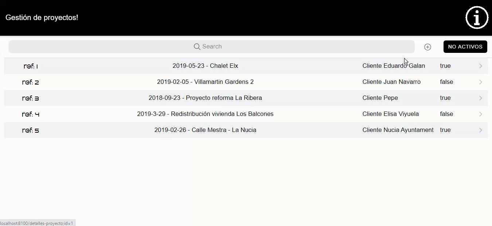
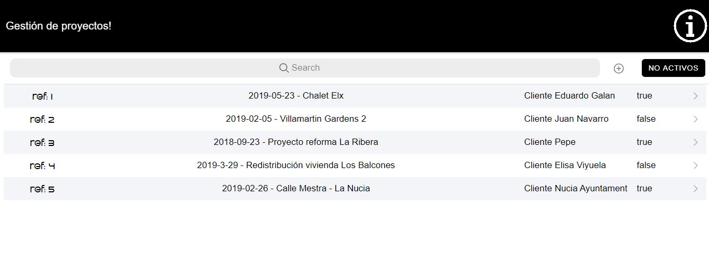
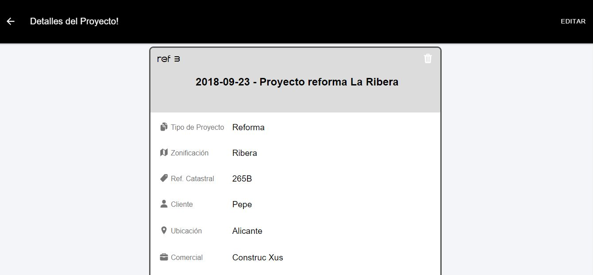
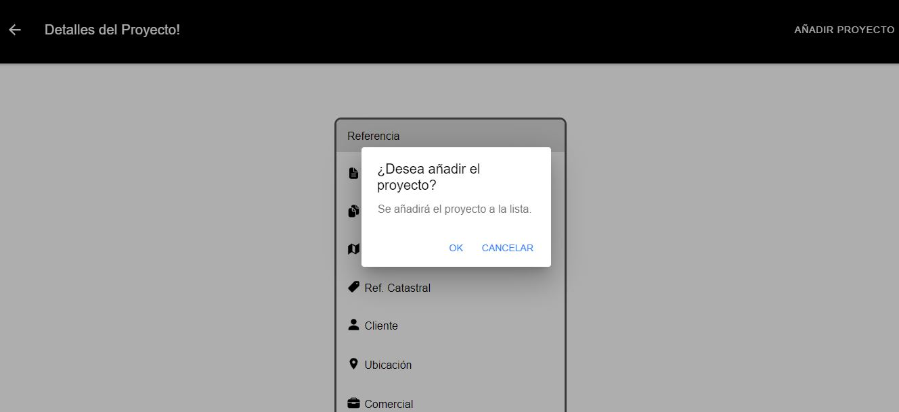

# architecture-project-management-front
First Fullstack project, draft project management with Angular 9 and Ionic

# Stack of technologies
#Angular9 #Ionic #springmvc #postgresql #mysql

UX

List of projects

Project details

Add new project

# Functionality
<ul>
  <li>Save-edit-delete projects</li>
  <li>basic CRUD</li>
  <li>search projects</li>
  <li>organize by active/finished projects</li>
</ul>
